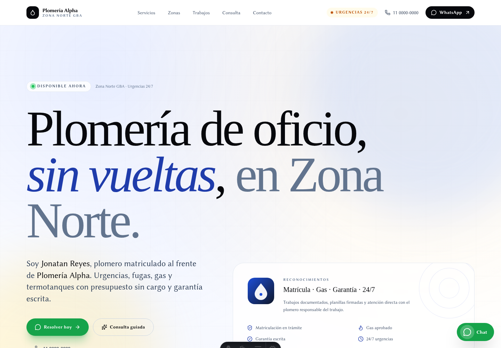
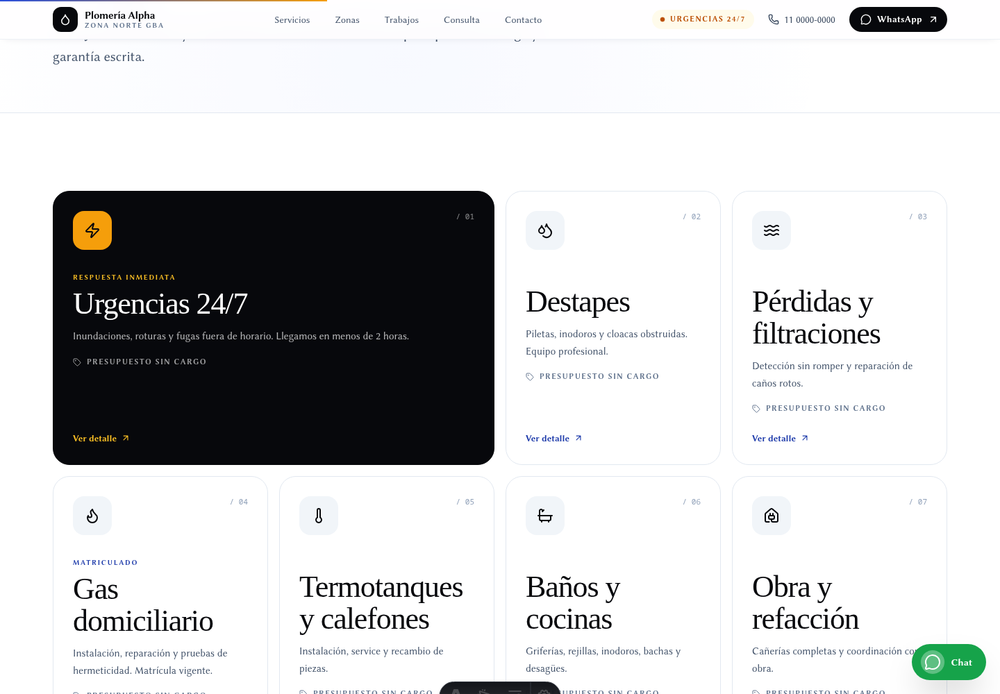
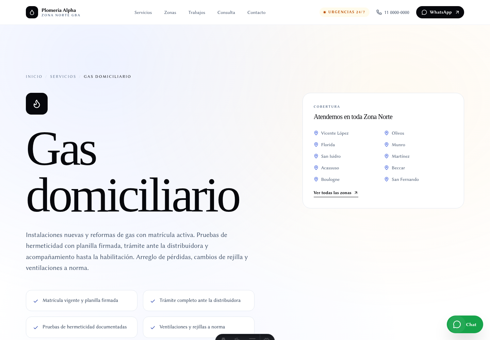
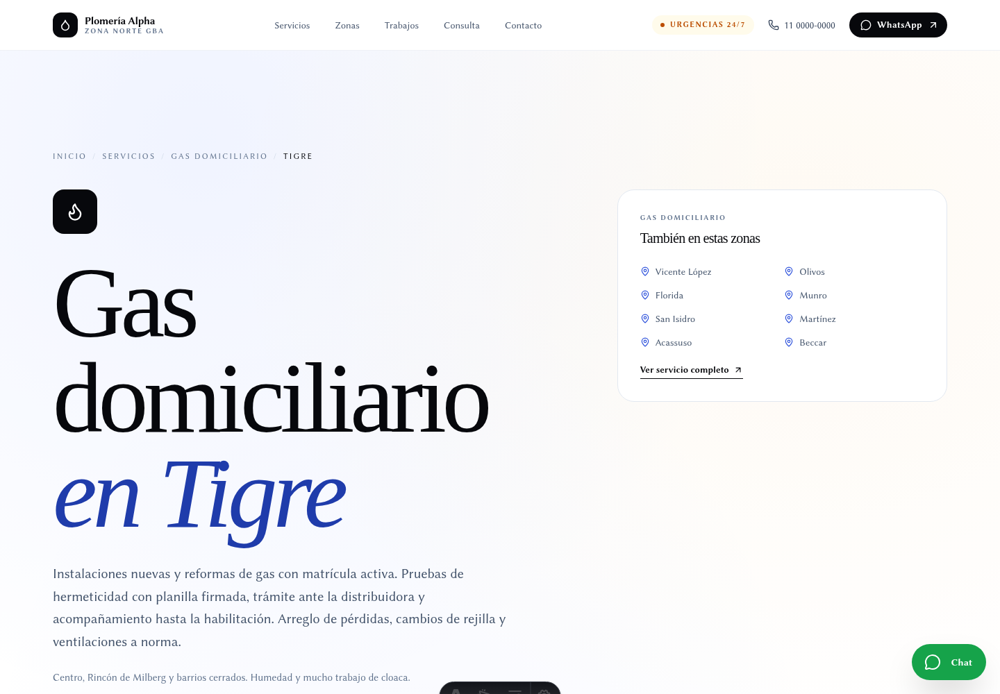
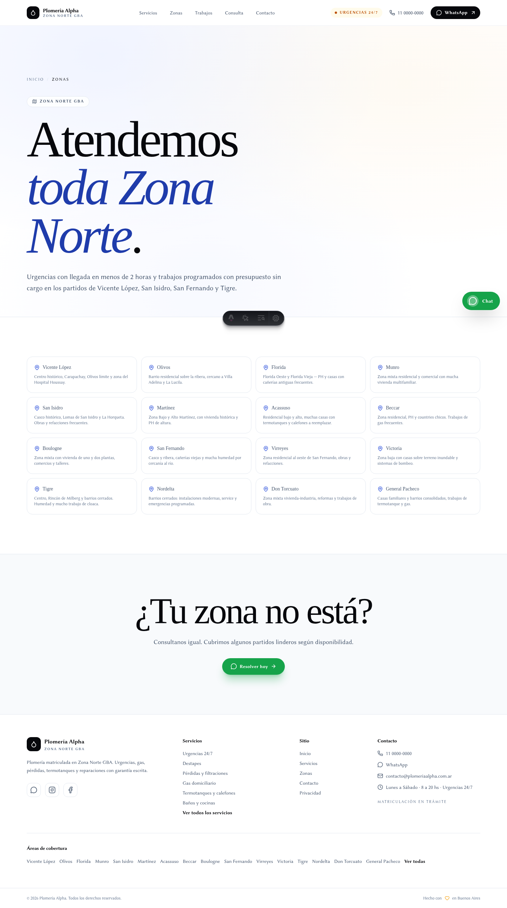
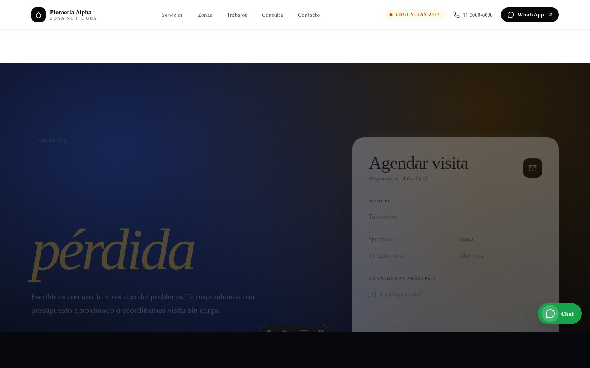

# Plomería Alpha — Zona Norte GBA

Sitio web profesional de [Plomería Alpha](https://plomeriaalpha.com.ar),
servicio de plomería matriculada en Vicente López, San Isidro, San Fernando
y Tigre. Fundado por **Jonatan Reyes**.

Construido con Astro + Tailwind CSS v4, optimizado para conversión, SEO
local y performance en mobile.



---

## Preview

### Home


| Hub de servicios | Detalle de servicio |
| :--- | :--- |
|  |  |

| Cross page (servicio × zona) | Hub de zonas |
| :--- | :--- |
|  |  |

| Contacto |
| :--- |
|  |

---

## Stack

- **Astro 6** con generación estática (142 páginas)
- **Tailwind CSS v4** vía `@tailwindcss/vite`
- **Tipografía**: Fraunces Variable (display) + Inter Variable (body),
  self-hosted con `@fontsource-variable`
- **Iconos**: `astro-icon` con set Lucide + logos
- **SEO**: `astro-seo`, JSON-LD (Plumber, Organization, OfferCatalog,
  Service, BreadcrumbList, FAQPage), sitemap con priority/changefreq
  custom, OG image propio
- **Animaciones**: sistema vanilla TypeScript con IntersectionObserver,
  lerp, spring physics, guards de `prefers-reduced-motion` y `pointer: fine`
- **Form**: Formspree (env-gated), honeypot anti-spam, consent checkbox
  (Ley 25.326 AR), pre-fill desde URL, upload opcional de foto/video,
  validación regex de teléfono AR
- **Analytics**: Plausible (cookieless) + Microsoft Clarity (session
  replay), ambos env-gated. Eventos: WA clicks, wizard complete, form
  submit, scroll depth (25/50/75/90%)

---

## Arquitectura de páginas

- `/` — landing con 10 secciones (Hero, TrustStrip, QuickWizard,
  Services, Zones, WhyUs, Gallery, FAQ, Contact)
- `/servicios` — hub con los 7 servicios
- `/servicios/[slug]` — detalle por servicio con wizard mini, FAQ
  específica, related services
- `/servicios/[slug]/[zone]` — **112 páginas long-tail** (7 servicios
  × 16 zonas) con wizard preset + FAQ
- `/zonas` — hub con las 16 zonas
- `/zonas/[slug]` — detalle por zona linkeando cross pages
- `/contacto`, `/gracias`, `/privacidad`, `/404`

Total: **142 páginas** generadas estáticamente.

---

## Desarrollo

```sh
pnpm install
pnpm dev          # localhost:4321
pnpm build        # genera ./dist
pnpm preview      # sirve ./dist local
```

### Variables de entorno

Crear `.env` en la raíz:

```ini
# Analytics (opcionales — si faltan, el script no se inyecta)
PUBLIC_PLAUSIBLE_DOMAIN=plomeriaalpha.com.ar
PUBLIC_CLARITY_ID=xxxxxxxxxx

# Form (obligatorio en prod — sin esto el form no envía)
PUBLIC_FORMSPREE_ID=xxxxxxxxxxxx

# Deploy host override (default: plomeriaalpha.com.ar)
SITE_URL=https://plomeriaalpha.com.ar
```

---

## Estructura

```
src/
  components/       # Secciones y widgets reutilizables
  data/site.ts     # Source of truth: services, zones, CTAs, schema
  layouts/         # BaseLayout con SEO + JSON-LD
  pages/           # Rutas
  scripts/motion.ts  # Animaciones + wizards + tracking
  styles/global.css  # Tailwind v4 + utilidades
public/            # Estáticos (OG image, favicon, robots)
```

Toda la configuración de contenido (servicios, zonas, CTA copy, precios
hint, FAQ por servicio) vive en `src/data/site.ts` como única fuente de
verdad.

---

## Features destacados

- **QuickWizard** de 3 pasos en landing: servicio → zona → urgencia,
  genera mensaje WhatsApp contextualizado con UTM tracking.
- **MiniWizard** adaptativo en páginas de detalle: preset de servicio
  (y zona en cross pages) para reducir fricción.
- **Mobile sticky bar**: llamar urgencia + WhatsApp siempre visibles
  en mobile.
- **112 cross pages SEO** long-tail generadas desde dos arrays.
- **Schema.org completo**: Plumber + Organization + OfferCatalog +
  FAQPage por página + BreadcrumbList en todas las rutas jerárquicas.

---

## Licencia

Código privado. Propiedad de Plomería Alpha.
